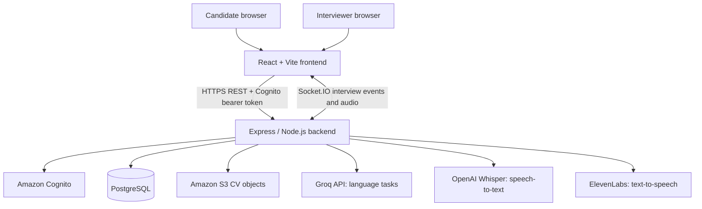

# Poold

> **An AI-assisted, skills-based interview platform for structured candidate evaluation.**

[](https://react.dev/)
[](https://nodejs.org/)
[](https://aws.amazon.com/)
[](https://www.postgresql.org/)
[](https://groq.com/)
[](https://socket.io/)

## Project overview

Poold helps candidates and interviewers run skills-focused interview workflows. Resumes provide useful context, but alone they offer limited evidence of how someone approaches role-related questions. Poold combines candidate profile and job requirements with structured interview questions, responses, transcripts, and AI-generated analysis to give interviewers more material to review.

Candidates can create an account, upload a CV, browse active job postings, and prepare for or take an interview. CV and job-description content can be analyzed to extract structured profiles and compare role requirements. The interview experience supports a live voice-oriented flow as well as a question-and-answer interview flow.

Interviewers can create and manage job postings and review candidate, session, response, and analysis information through interviewer views. Generated summaries and response analysis are intended to support human review; they are not a substitute for interviewer judgment.

## The problem

Resume screening and unstructured interviews can leave recruiters with incomplete or inconsistent evidence of a candidate's practical skills. Reading applications, mapping experience to requirements, and comparing interview responses also takes time. Poold organizes job requirements and interview evidence in one workflow so candidates can demonstrate relevant experience and interviewers can review it in context.

## How Poold works

### Candidate workflow

1. Create an account and sign in.
2. Browse active job postings or begin an interview setup.
3. Upload a PDF or DOCX CV and provide or select job requirements.
4. Review extracted candidate and job profiles, including a skills-gap view where available.
5. Start an interview. Questions can be generated from the role and candidate information, or the candidate can use the live Maya interviewer flow.
6. Submit text or spoken responses. In the live flow, audio is streamed to the backend, transcribed, and used to drive the next interviewer response.
7. Review the transcript and generated interview assessment when the interview flow provides one.

### Interviewer workflow

1. Create, update, publish, or remove job postings.
2. Review interview sessions, candidate details, responses, CV/job gap analyses, and available assessment data in the interviewer dashboard.
3. Use transcripts and generated summaries as supporting information for evaluation.

The code includes candidate applications and session records. Exact end-to-end behavior depends on the configured backend services and credentials.

## Key features

### Candidate experience

- CV upload for PDF and DOCX files to Amazon S3.
- CV and job-description parsing into structured profiles.
- Active job-posting browse and application flow.
- CV-to-job requirement gap analysis.
- Interview question generation and guided interview setup.
- Maya live interviewer with voice-oriented conversation and transcript display.
- Interview summary and response analysis views, with JSON summary export.

### Interviewer experience

- Job posting management.
- Dashboard views for sessions, responses, candidate details, and gap analyses.
- Transcript and generated assessment data for review.

### Platform

- Amazon Cognito sign-up, sign-in, token refresh, and identity verification.
- Express API with authenticated routes and role-aware data access.
- PostgreSQL persistence for users and interview/job data.
- Amazon S3 object storage with time-limited presigned download URLs for uploaded CVs.
- Socket.IO transport for the Maya interview pipeline.

## AI interview experience

Poold has two interview-related paths in the code. The guided interview flow can generate questions from candidate and role profiles, analyze responses, and produce a final assessment. Maya is a live interviewer implemented over Socket.IO: it receives candidate audio, transcribes it, uses a language model to compose the next question or response, and sends events back to the client. The frontend includes speech playback integration through ElevenLabs.

Groq is used for language-model tasks such as CV and job-description parsing, question generation, response analysis, interview summaries, and Maya's conversational response generation. Model IDs are configurable through environment variables. The current defaults are listed below. Audio transcription code still calls the OpenAI audio transcription endpoint with `whisper-1`; it therefore requires an OpenAI API key in the current implementation. ElevenLabs text-to-speech is also an external integration and requires its own key.

## AWS and data architecture

| Service / component | Responsibility in the code |
| --- | --- |
| Amazon Cognito | User-pool sign-up/sign-in and token-based identity; backend maps Cognito identities to application users. |
| Amazon S3 | Stores uploaded CV objects; backend returns presigned download URLs. |
| PostgreSQL | Persists application users, postings, applications, interview sessions, responses, transcripts, and analysis. The connection supports local PostgreSQL or a PostgreSQL host such as Amazon RDS. |
| Express / Node.js | REST API, authentication checks, AI service calls, and Socket.IO server. |
| Groq API | Text-generation and reasoning requests from backend services. |
| OpenAI audio transcription API | Speech-to-text in the current transcription endpoint and Maya audio-processing path. |
| ElevenLabs | Text-to-speech endpoint used by the voice experience. |

The repository includes a PostgreSQL schema at [`database/aws_schema.sql`](database/aws_schema.sql). Although that schema is documented for RDS PostgreSQL, the application connects through standard PostgreSQL connection settings; the repository alone does not establish which hosted database instance is deployed.

## AI providers and configured models

| Provider | Model / configuration | Current use |
| --- | --- | --- |
| Groq | `openai/gpt-oss-120b` (`GROQ_MODEL_TEXT`) | Default for CV/job parsing, generated questions, response analysis, and summaries. Despite the model ID prefix, requests are sent to Groq's API. |
| Groq | `openai/gpt-oss-20b` (`GROQ_MODEL_FAST`) | Maya live-interview response generation. |
| Groq | `qwen/qwen3.8-27b` (`GROQ_MODEL_VISION`) | Configured model value for the job-description analysis vision path; that code's fallback is `qwen/qwen3.6-27b`. |
| OpenAI | `whisper-1` | Audio transcription in the standalone transcription endpoint and the Maya WebSocket audio pipeline. |
| ElevenLabs | `eleven_turbo_v2` (default) | Text-to-speech; the backend allows a voice/model override in the request. |

The Groq text model settings can be overridden in the backend environment. The `GROQ_MODEL_VISION` setting is only used for the file/vision branch in job-description analysis; the text analysis path uses `GROQ_MODEL_TEXT`.

## System architecture



## Real-time interview communication

The backend creates a Socket.IO server and exposes the interview namespace at `/interview`. The frontend includes a WebSocket client and Maya interview page. During the live flow, the client sends audio chunks and interview metadata; the backend buffers audio, sends it for transcription, passes recognized candidate speech into Maya's Groq-powered response generation, then emits interviewer and transcript events to the client. Audio output is handled through the ElevenLabs TTS endpoint and frontend playback utilities.

This repository uses Socket.IO/WebSocket transport for this path. WebRTC is not used by the current implementation. The `/realtime-session` route is retained as a deprecated endpoint and returns HTTP 410; it is not an active OpenAI Realtime integration.

## What we worked on

Poold began as an existing, in-progress project. During the AWS hackathon, the work focused on adapting and stabilizing that codebase for a usable demonstration rather than building the entire product from scratch.

- Debugged application issues and repaired frontend/backend flows and integrations.
- Migrated active authentication and file-storage integrations from Supabase toward Amazon Cognito and Amazon S3.
- Added a PostgreSQL-backed Express data layer; the schema and connection configuration support PostgreSQL deployments, including RDS.
- Adapted text-generation and reasoning integrations to use Groq, with separate configurable models for different workloads.
- Connected the live interview audio flow to transcription and speech playback integrations. The current repository still uses OpenAI Whisper for speech-to-text and ElevenLabs for text-to-speech.
- Updated configuration and environment handling to support the migrated services.

Historical Supabase references remain in comments and migration/schema context, but the active frontend and backend data/auth flows use the Express backend, Cognito, and PostgreSQL. No Supabase client package is present in the active application dependencies.

## Technology stack

| Area | Technologies |
| --- | --- |
| Frontend | React 18, TypeScript, Vite, React Router, Tailwind CSS, shadcn/ui components, Zustand, TanStack Query |
| Backend | Node.js, Express 5, JavaScript, Multer |
| Authentication | Amazon Cognito, JWT verification (`jsonwebtoken`, `jwks-rsa`) |
| Database | PostgreSQL (`pg`) |
| Cloud storage | Amazon S3 (`@aws-sdk/client-s3`, presigned URLs) |
| AI | Groq API; OpenAI Whisper transcription; ElevenLabs text-to-speech |
| Real-time | Socket.IO server/client and browser WebSocket client |
| Document processing | `pdf-parse`, `pdfjs-dist`, `mammoth` |

## Product tour

Watch the project tour: [Poold on YouTube](https://youtu.be/zubQUJdDRFU).

The repository contains a logo and generic placeholder illustrations, but no product screenshots. Add dashboard or interview screenshots here when they are available.

## End-to-end flow

```text
Candidate / Interviewer
          ↓
 Cognito authentication
          ↓
 Job posting browse or management
          ↓
 CV upload → S3 → CV and role analysis
          ↓
 Interview setup and question generation
          ↓
 Maya live interview over Socket.IO
          ↓
 Audio transcription → interview transcript and responses
          ↓
 Generated analysis and interviewer review
```

## Repository layout

```text
poold-main/
├── backend/             # Express API, Cognito auth, PostgreSQL, S3, AI and interview services
├── database/            # PostgreSQL schema for the AWS-oriented deployment
├── frontend/             # React + Vite application
└── README.md
```

## Local development

### Requirements

- Node.js (the backend uses Node built-in `fetch`, `FormData`, and `File`; use a current Node release)
- npm
- PostgreSQL
- Configured Cognito user pool, S3 bucket, Groq API key, OpenAI API key for current Whisper transcription, and ElevenLabs API key for speech output

### Install and configure

Install the frontend and backend dependencies in their respective directories:

```bash
cd frontend
npm install
cp .env.example .env

cd ../backend
npm install
cp .env.example .env
```

Fill in the backend and frontend environment variables described below. Configure the PostgreSQL database with the schema in `database/aws_schema.sql` as appropriate for your deployment.

### Run

In one terminal:

```bash
cd backend
node index.js
```

In another terminal:

```bash
cd frontend
npm run dev
```

The backend defaults to port `3000`. The frontend development server URL is printed by Vite. Set `FRONTEND_ORIGIN` in the backend environment to the frontend origin used locally so the API CORS policy allows it.

## Environment variables

Create local `.env` files from the example files. Do not commit credentials.

### Backend (`backend/.env`)

```env
PORT=3000
FRONTEND_ORIGIN=http://localhost:5173

GROQ_API_KEY=your_groq_api_key
GROQ_MODEL_TEXT=openai/gpt-oss-120b
GROQ_MODEL_FAST=openai/gpt-oss-20b
GROQ_MODEL_VISION=qwen/qwen3.8-27b
OPENAI_API_KEY=your_openai_api_key
ELEVENLABS_API_KEY=your_elevenlabs_api_key

DB_HOST=localhost
DB_PORT=5432
DB_NAME=poold
DB_USER=your_database_user
DB_PASSWORD=your_database_password
DB_SSL=false

COGNITO_USER_POOL_ID=your_user_pool_id
COGNITO_CLIENT_ID=your_app_client_id
COGNITO_REGION=your_aws_region
S3_BUCKET_NAME=your_bucket_name
AWS_REGION=your_aws_region
```

The AWS SDK uses the standard credential provider chain. `AWS_ACCESS_KEY_ID` and `AWS_SECRET_ACCESS_KEY` are read when explicitly provided, but should be supplied only through a secure local/deployment secret mechanism (or use an attached IAM role where available).

### Frontend (`frontend/.env`)

```env
VITE_BACKEND_URL=http://localhost:3000
VITE_API_BASE_URL=http://localhost:3000/api
```

## Current status

**Status:** Hackathon prototype / working demonstration. The repository contains candidate and interviewer interfaces, job-posting and interview flows, Cognito authentication, PostgreSQL-backed APIs, S3 CV uploads, Groq text-generation services, and a Socket.IO Maya interview pipeline. Working end-to-end use depends on configuring the external services and credentials listed above.

## Future improvements

- Add automated integration coverage for authentication, uploads, job workflows, and interviews.
- Improve evaluation consistency and make generated assessments easier to audit against transcript evidence.
- Expand recruiter workflows for application review and interview scheduling.
- Add operational monitoring, deployment guidance, and production-oriented security hardening.
- Review the remaining OpenAI transcription dependency and consolidate AI provider configuration if desired.

## Team and credits

Built and adapted by the Poold hackathon team. Individual contributor names are not specified in the repository.
